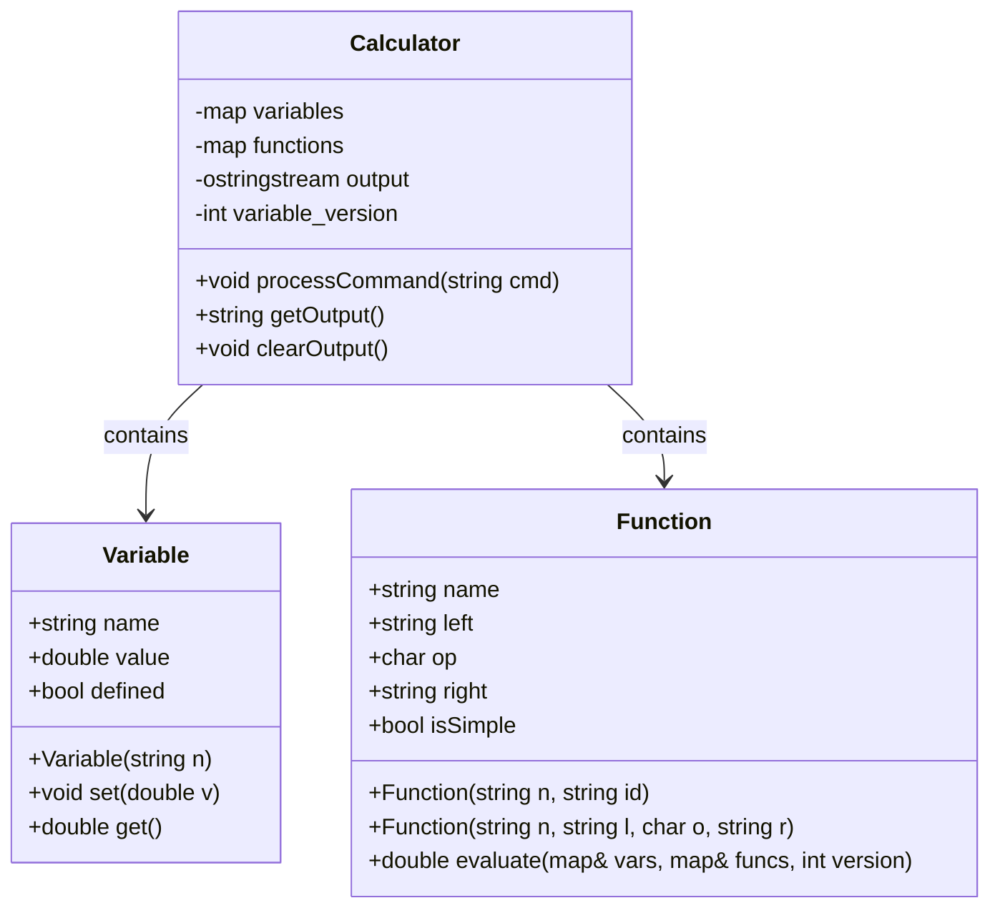

```mermaid
classDiagram
    class Calculator {
        -map<string, Variable> variables
        -map<string, Function> functions
        -ostringstream output
        -int variable_version
        +void processCommand(string cmd)
        +string getOutput()
        +void clearOutput()
    }
    class Variable {
        +string name
        +double value
        +bool defined
        +Variable(string n)
        +void set(double v)
        +double get()
    }
    class Function {
        +string name
        +string left
        +char op
        +string right
        +bool isSimple
        +Function(string n, string id)
        +Function(string n, string l, char o, string r)
        +double evaluate(map<string, Variable>& vars, map<string, Function>& funcs, int version)
    }
    Calculator --> Variable : contains
    Calculator --> Function : contains
```